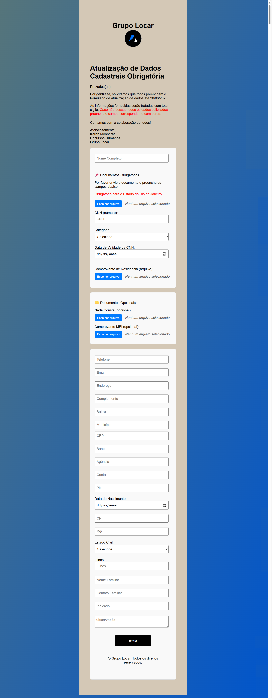

# 📝 Formulário de Atualização de Dados – Grupo Locar

Este repositório contém o formulário online de preenchimento obrigatório utilizado pelo Grupo Locar para atualização de dados cadastrais dos colaboradores.
Todos os campos são validados no navegador e os documentos obrigatórios precisam ser anexados corretamente para o envio ser concluído.

## 📷 Pré-visualização

## 📁 Arquivos incluídos

- `index.html` – Página principal do formulário
- `index.css` – Estilos do formulário
- `agradecimento.html` – Página exibida após envio bem-sucedido
- `Logotipo.png` – Logotipo institucional exibido no formulário
- `Formulario-cadastro.png` – Captura de tela da interface do formulário

